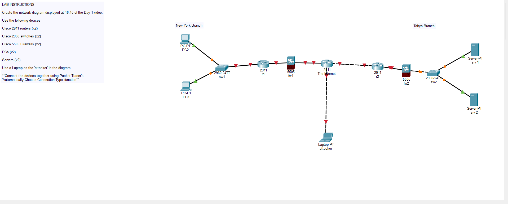

<h1>

<strong>Day 1</strong>

Durant cette vidéo, on a appris les différents appareils dans un réseau informatique et leur fonction :

ROUTEUR : Appareil informatique qui permet la communication entre des réseaux différents. 

SWITCH : Permet de relier des appareils dans le même réseau et de les faire communiquer. 

FIREWALL : Permet de filtrer le trafic entre les réseaux et sécuriser la communication. 

SERVEUR : Appareil informatique qui fournit des services et des fonctions aux clients.

CLIENT : Appareil qui accède à un service mis à disposition par un serveur.

On devait faire ce schéma sur Cisco Packet Tracer :

Il représente deux réseaux différents qui essaient de communiquer en passant par Internet, et un attaquant qui essaie d’intercepter les données de la communication.

</h1>