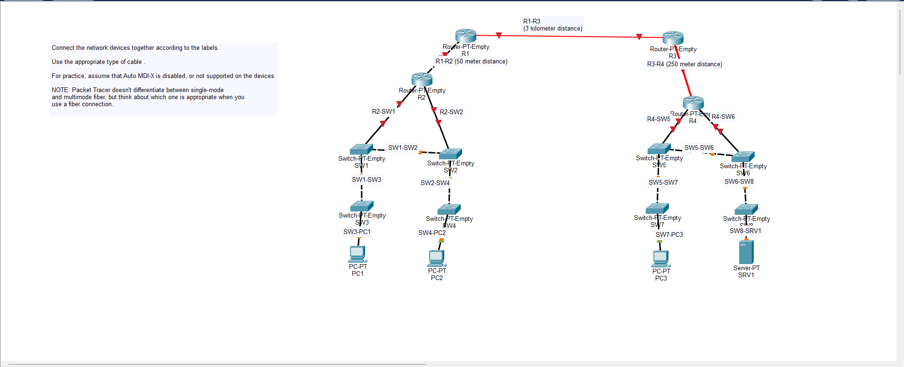

<h1>

<strong>Day 2</strong>

Durant cette vidéo, on a appris les différents types de câbles, d'interfaces et de connexions utilisés dans un réseau informatique :

<strong>RJ45 :</strong> Connecteur utilisé pour connecter un câble Ethernet à un appareil réseau. 

<strong>UTP :</strong> Type de câble Ethernet composé de plusieurs paires de fils torsadés. 

<strong>CÂBLE DROIT :</strong> Permet généralement de connecter des appareils différents, par exemple un PC à un switch. 

<strong>CÂBLE CROISÉ :</strong> Permet généralement de connecter des appareils similaires, par exemple deux PC ou deux switches. 

<strong>AUTO MDI-X :</strong> Permet à certains appareils de détecter automatiquement le type de connexion nécessaire. 

<strong>SFP :</strong> Petit module que l'on insère dans une interface d'un switch ou d'un routeur pour permettre une connexion réseau, notamment avec de la fibre optique. 

<strong>MULTIPLEX :</strong> Permet de transmettre plusieurs signaux sur une même liaison. 

<strong>FIBRE OPTIQUE :</strong> Permet de transmettre les données avec de la lumière et peut être utilisée pour communiquer sur de longues distances. 

<strong>FIBRE MULTIMODE :</strong> Utilisée principalement pour des distances plus courtes. 

<strong>FIBRE SINGLEMODE :</strong> Utilisée principalement pour des communications sur de longues distances. 

On devait également faire des connexions entre différents appareils sur Cisco Packet Tracer pour comprendre l'utilisation des câbles et des interfaces.

</h1>

